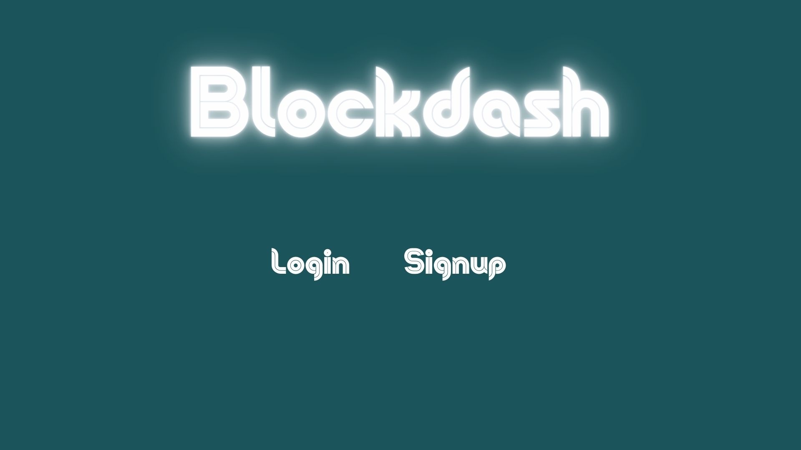
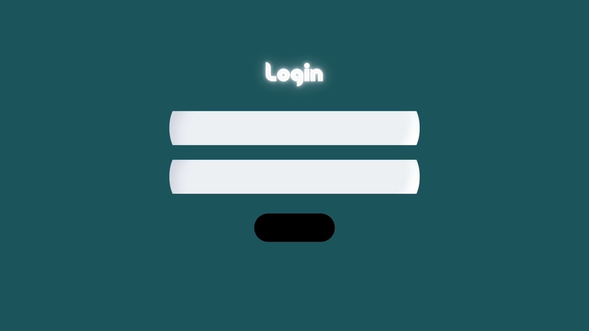
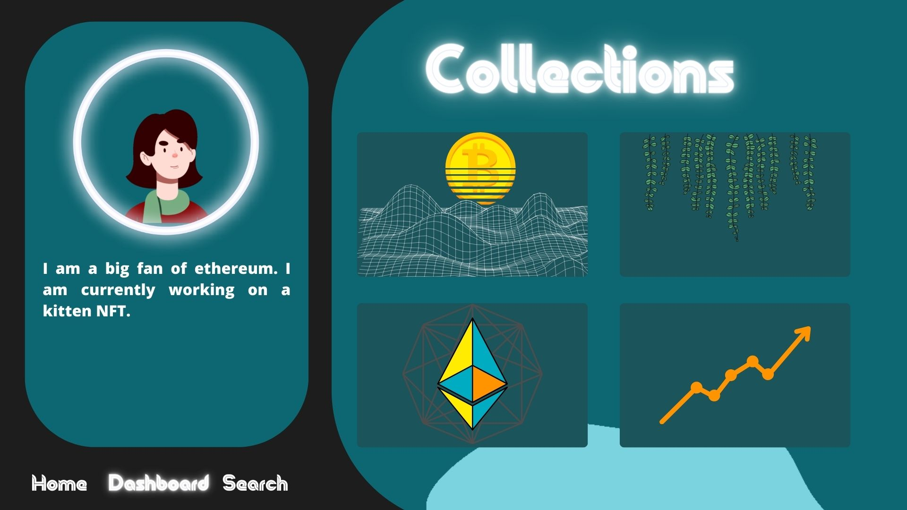
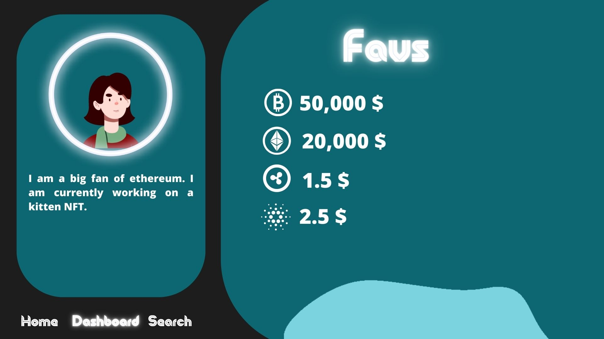
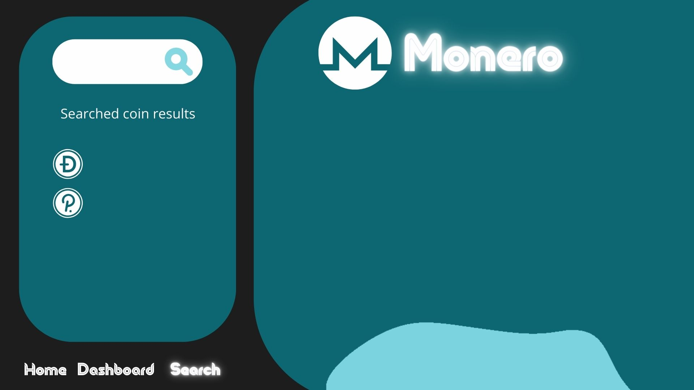
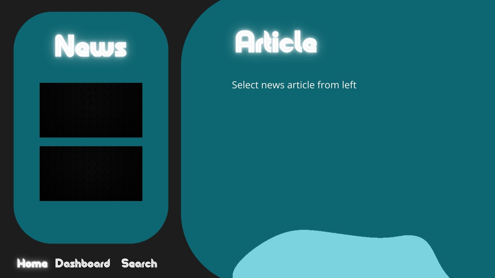

# Blockdash
Blockdash is a platform that allows you to track your favorite cryptocurrencies. Create collections and add your favorite coins to them- then see their prices and details on a beautiful interface. You can also view crypto news and add it to collections.
# User Stories

Comes on landing page. Shows what the website does, and contains a sign up link. User clicks on the signup link.
-User signs up for an account with their name, email, password, 
-User will then login with their email/password
- The default page would be your dashboard that contains your collections and your profile. Here you can create, edit, and delete collections
- The user can then navigate to search page where you can look up coins and add to a specific collection.
- The home page acts like a news feed where you can see all the articles related to crypto and blockchain.

# Dependencies/Tools

Express- Web Framework
React- Client-side rendering and API calls
MongoDB - Database
Node- Web Server
MVC- Organization
Coin Gecko- Crypto price api
Sass- CSS
Heroku- Deployment

# MVP
- News page displays the news with an api call
- Full navbar functionality
- Basic Auth functionality
- Collections can be created and deleted.
- Dashboard displays user profile picture, bio, and collections.
- Search page with the ability to search up coins.
- Functioning API calls for cryptocurrencies.
- Coins can be added and removed from collections.

# Stretch Goals
- Have the ability to add news articles to a
collection.
- Third party authentication.
- Ability to choose theme for the website.

# Milestones

Phase 1 (2 days )
- Displaying coins and their details with an API.
- Ability to create collections and add coins to them.
- User created
- Crud for collections
Phase 2 (2 days)
- Routes to different pages.
- Styling
- Fetch News
 Phase 3 (2 days)
- User auth
- Add news to collection
- Complete MVP
 Phase 4 (1 day)
- Stretch goals
Final Phase 
Debugging and submission

