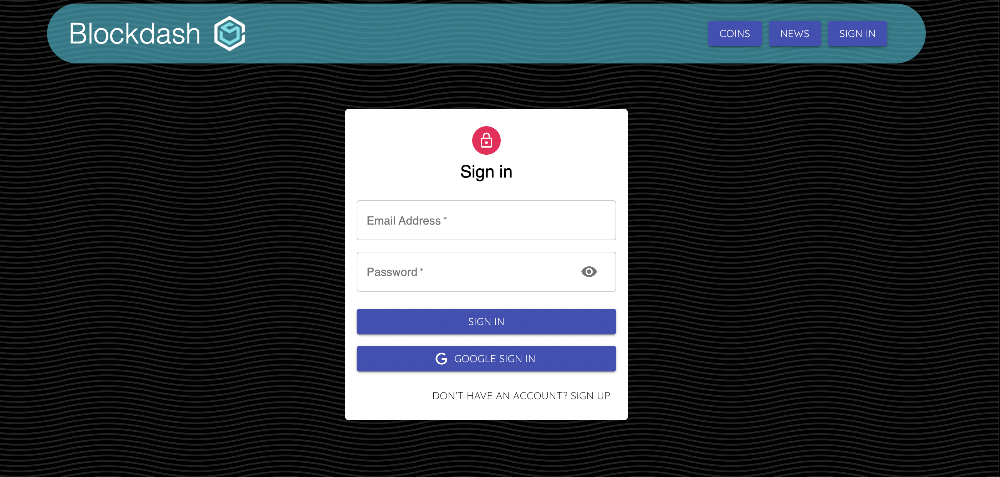

# Blockdash
Blockdash is a platform for all things crypto. Here you can check coin prices, follow the latest news and engage with thoughful posts related to cryptocurrencies and blockchain. 

# User Stories
- User comes on the post page. Here users can see all the posts.
- User signs up for an account with their name, email, password. Users are automatically logged in after signing up. Users can also login with google. This allows them to interact with posts and create their own posts.
- The default page would be the post page with posts on the left and a post creation form on the right. 
- The user can then navigate to the coins page where they can look at coin prices, market cap, and other stats related to a specific coin. User can also search up specific coins.
- The news page shows the latest, and trending news related to crypto
- When user logs out, the user will not be able to intreact with posts or create posts.

# Dependencies/Tools

Express- Web Framework
React- Client-side rendering and API calls
Redux- State Container.
MongoDB - Database
Node- Web Server
MVC- Organization
Coin Gecko- Crypto price api
Newsapi- Crypto news api
Material UI- Component Styling
Netlify- Front-end deployment
Heroku- Back-end deployment

# Screenshots

# ERD

